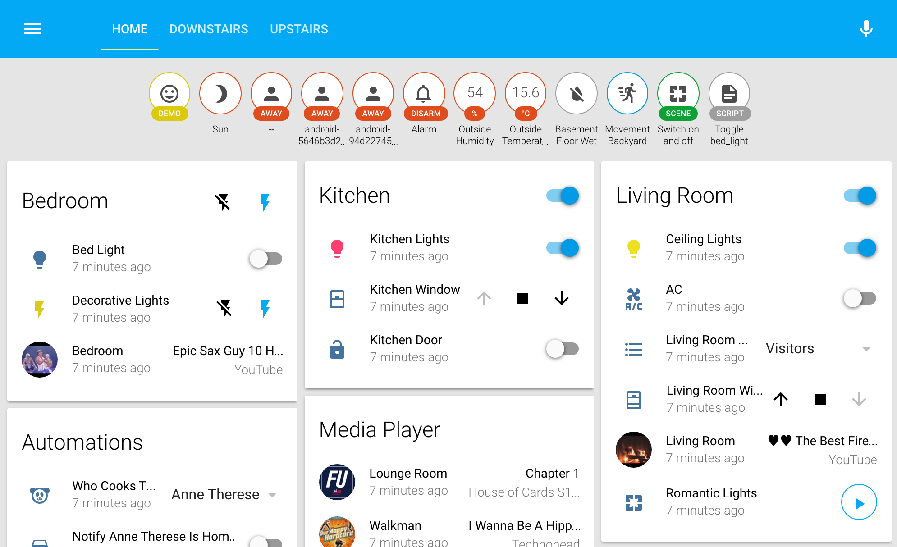
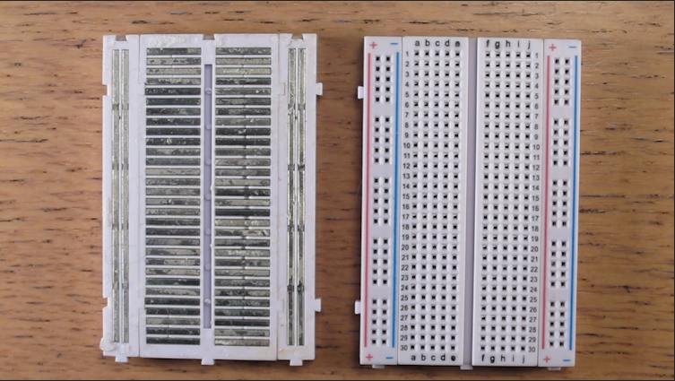
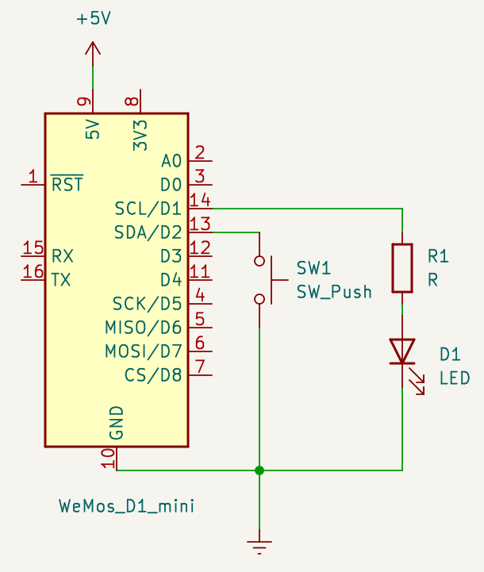

# Introduction à la domotique DIY

Avec Home Assistant et ESPHome

---

## Agenda

- Introduction à Home Assistant et ESPHome
- Quelques bases d'éléctronique
- Construisez votre premier object connecté!
- La maison connecté façon DIY
- Tout contrôler à partir de Home Assistant

---

## Introduction - Home Assistant

https://www.home-assistant.io/

---

## Introduction - ESPHome

https://esphome.io/

ESPHome est un écosystème pour contrôler votre ESP8266/ESP32 grâce à des fichiers de configuration et les contrôler à distance avec Home Assistant.

--- 

#### Quelques bases d'éléctronique

**U = R x I**
- **U** est la tension aux bornes de la résistance
- **R** est la valeur de la résistance
- **I** est l’intensité du courant qui circule à travers la résistance

--- 
#### Quelques bases d'éléctronique

Breadboard:

--- 
#### Quelques bases d'éléctronique

Assurez vous que votre circuit est débranché avant de faire des modification, pour éviter un court-circuit accidentel.

En cas de doute levez la main!

---

#### Votre premier object connecté

--- 
## La maison connecté façon DIY

--- 
## Tout contrôler à partir de Home Assistant